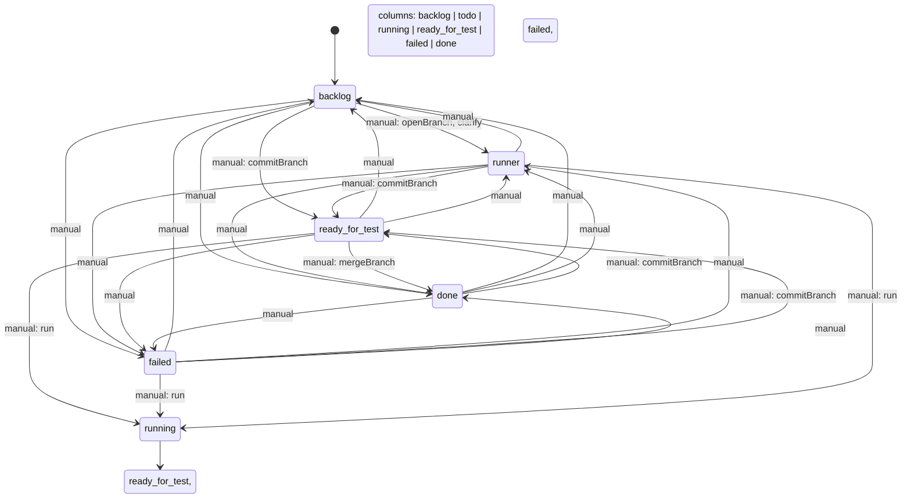

# State machine of the task board

The board's **columns are the task states**: the machine below is what the Host
enforces and what the browser renders. It is declared as plain data in
`src/core/state-machine.ts` (`DEFAULT_STATE_MACHINE`) and can be replaced per
deployment through the plugin config / settings namespace `task-board`, field
`stateMachine`.

A *transition* is an allowed state change together with the **actions** that
fire when it happens (open a feature branch, commit a feature branch, merge a
feature branch, start a run, open the clarification session, stamp a field).
Drag & drop is validated
against exactly these transitions — the browser asks the machine whether a drop is allowed, and the
Host refuses any `move` the machine does not list.



*Regenerate after changing the machine:*

```sh
node scripts/render-state-machine.mjs
```

`tests/state-machine.spec.ts` fails when this diagram no longer matches the
definition.

## Triggers

| Trigger  | Who fires it                                              |
|----------|-----------------------------------------------------------|
| `manual` | A human: drag & drop on the board, or a chip in the task detail. |
| `runner` | The execution runner settling a run (success → `ready_for_test`, failure → `failed`, cancel → `todo`). |
| `cron`   | A scheduled run.                                          |

`running` is the runner's own state: it carries `"drop": false` and only
`runner` transitions leave it. It is *entered* through the `run` action
(`todo → running`), never by a plain status move.

## Clarification step in `todo`

`backlog → todo` is the card's **clarification step**, and it runs for every
card:

* The transition fires `clarify`, which starts the card's **clarification run**:
  the run column's execution, started through the same launch queue but **not**
  through the lane WIP limit — `todo` is WIP-free, so the round starts right away
  even while another card of the same workspace is working (no **Queued** badge),
  with the same session link and the same pause/resume control. It checks no
  branch out, because it implements nothing. Its prompt is the
  card's normal run prompt plus the clarification block *"Bitte kläre jetzt alle
  offenen Fragen — und implementiere noch nichts. / Stelle deine Fragen und
  stoppe dann. / Wenn noch Fragen offen sind, stelle die nächsten und stoppe
  wieder. / Wenn du alles geklärt hast stoppe und fasse nur kurz zusammen. / Die
  Implementierung beginnt erst mit «Bitte jetzt implementieren»."*.
* **The questions are the agent's, not a form field.** There is no question list
  on the card: the agent asks what it still needs to know **in the chat** of
  that run, the human answers there, and the agent ends its turn.
* **Stopping is enforced past the first turn.** The board's system-prompt
  section (`TASK_BOARD_GUIDANCE`) carries a clarification-session stop rule that
  keys off the first line of that block and is re-sent with *every* turn: while
  a session is a clarification session, the agent implements nothing — after
  each answer it asks the next question and stops, or stops for good once the
  questions are settled. The wording of the block and the rule cannot drift: the
  rule interpolates the very lines the run sends (`CLARIFICATION_ADDENDUM`). It keeps the
  card in `todo` — settling the run never changes the column.
* The run lands in the card's one conversation (`clarificationSessionId`); the
  run that implements the card continues that same session, so the answers stay
  in context and no second conversation is opened. Passing the step again
  re-enters that conversation.
* A drag straight from `backlog` to `running` has no transition at all: the
  card must pass the clarification step in `todo` first.
* Pulling the card on to the run column — or its Run button — is the
  **go-ahead**: it closes the card's open clarification round (recorded as
  cancelled; a round whose launch has not started yet is dropped, and one whose
  session is still being created has that late session stopped instead of
  attached — so the card owns exactly one open execution and one conversation)
  and continues that conversation with *"Bitte jetzt implementieren."*. The
  implementation run itself is an ordinary run and still obeys the lane's WIP
  limit.
* A **group drop** (`move-many`) never opens executions — the same rule that
  keeps a batch from starting runs.

## Actions attached to transitions

| Action              | Effect                                                                 |
|---------------------|------------------------------------------------------------------------|
| `git.openBranch`    | Cuts the card's feature branch (`task/<slug>-<id8>`) from the base branch. No-op without a git repository. |
| `git.commitBranch`  | Commits the worktree onto the card's feature branch (`committedAt` stamp), cutting the branch first when the card has none. No-op without a repository or when the worktree is clean — never an empty commit. |
| `git.mergeBranch`   | Commits any leftover as a safety net and merges the branch back into its base branch, stamping `mergedAt`. |
| `run`               | Opens an execution for the card and moves it to the transition target (drag onto "In progress"). A human start releases the clarification gate and continues the card's clarification session; only cron refuses an unresolved card. |
| `clarify`           | Opens the card's clarification run: the same execution as `run` (same queue, but WIP-free — `todo` starts without waiting for a lane slot), its prompt asks the agent's open questions in the card's chat and stops, it checks no branch out, and settling it leaves the card in its column. |
| `{ kind: "stamp", field: "doneAt" }` | Writes a timestamp into a task field.                    |

In the shipped machine the git actions describe the agentic-programming flow:
`backlog → todo` opens the branch, every way into `ready_for_test` commits it
(`backlog →`, `todo →`, `done →` and `failed → ready_for_test` all carry
`git.commitBranch`), and `ready_for_test → done` merges it back. A branch or
merge hook that refuses fails the move, so a card never claims a branch or a
merge that did not happen; the commit hook is the deliberate exception — it
records its failure on the card (below) instead of blocking the park, because
uncommitted work must not keep a card out of the review column. The `run` action
sits on the way into `running`: `todo → running` starts the card, and
`ready_for_test → running` / `failed → running` pull a reviewed or failed card
straight back onto the run column (the run continues the card's conversation, so
a correction written there is already in context). `clarify`
rides the same `backlog → todo` transition as the branch hook — the card's
clarification step.

## Commit policy: nothing stays uncommitted

Work on a card happens on its **feature branch**, and the worktree is never left
holding uncommitted card work:

* The branch is cut when the card enters `todo` (and at run start when a cron
  trigger or the Run button skipped that step).
* **A run settles into `ready_for_test` only once its session has ended**: the
  runner reports `succeeded` after the newest `turn/end` solely when a fresh
  roster read no longer lists the session as running and its live inbox and jobs
  are quiet. An agent writing `FERTIG: <summary>` in its answer reports the work
  for the human; it does not move the card while the session is still running.
* Reaching **`ready_for_test` commits**: the `git.commitBranch` action covers
  every manual move into the column, and the runner's own settle
  (`running → ready_for_test`) commits through the same git helper, because a
  settle fires no configurable action. `git add -A` takes the whole worktree and
  commits it as `task: <title>`; a clean worktree produces no commit and leaves
  the previous `committedAt` in place.
* **Every settle commits, not only a successful one**: a failed run and a
  cancelled run (including the Host cancelling an interrupted start at restart)
  commit their work too, so nothing is left behind in any outcome. A
  clarification run implements nothing and checks no branch out — it never
  commits. A paused run is not settled and therefore commits nothing until it is
  resumed and settles.
* A commit that git refuses (a rejecting hook, say) **does not fail the move or
  the settle**: the error is appended to the newest execution's `error`, which
  the card's execution history in the detail view shows. A card that never ran
  has no execution to carry it and only gets a Host warning.
* The card's `TaskGit` records `committedAt` (the instant of the last commit, not
  shown in the UI) next to `mergedAt`.

## Rework: back to `todo` from the review

A card that did not pass the review (or whose run failed) goes back to `todo`
when the human writes the correction into the card's **own conversation**: the
Host watches those chats, fires the ordinary `ready_for_test → todo` (or
`failed → todo`) move on that human turn, and stamps the card (`reworkAt`,
`reworkCount`). No note text is stored anywhere — the transcript *is* the note,
and the send-back never starts a run. The card's next run is marked as the
rework round, continues the corrected conversation, and opens with a short
framing turn instead of the card body (see the README section *Write the
correction into the card's chat*).

## Configuration

```jsonc
{
  "initial": "backlog",
  "states": [
    { "status": "backlog" },
    { "status": "todo" },
    { "status": "running", "drop": false },
    { "status": "ready_for_test", "label": "Review" },
    { "status": "done" },
    { "status": "failed", "order": 9 }
  ],
  "transitions": [
    { "from": "backlog", "to": "todo", "actions": ["git.openBranch"] },
    { "from": "todo", "to": "running", "actions": ["run"] },
    { "from": "todo", "to": "ready_for_test", "actions": ["git.commitBranch"] },
    { "from": "ready_for_test", "to": "done", "actions": ["git.mergeBranch"] }
  ]
}
```

* `states[].status` — one of `backlog`, `todo`, `running`, `ready_for_test`,
  `done`, `failed` (the ledger's closed vocabulary). `label` overrides the
  column title, `order` moves the column, `drop: false` makes it a column that
  never accepts a card.
* `transitions[]` — `from`/`to` plus optional `trigger`, `actions`, `git`
  (`false` skips the git hooks of that transition). Anything not listed is
  refused. A custom machine should put `git.commitBranch` on its own ways into
  `ready_for_test`: stored configurations are left as they are, and only the
  runner's settle commits independently of the configured transitions.
* `initial` — where new cards land; required when `backlog` is not a column.

Invalid configuration never bricks the board: the normalizer refuses the whole
document with reasons, the machine in force stays, and the settings card marks
the field invalid. The Host hands its resolved machine to the browser inside
the snapshot, so both halves always validate against the same transitions.
