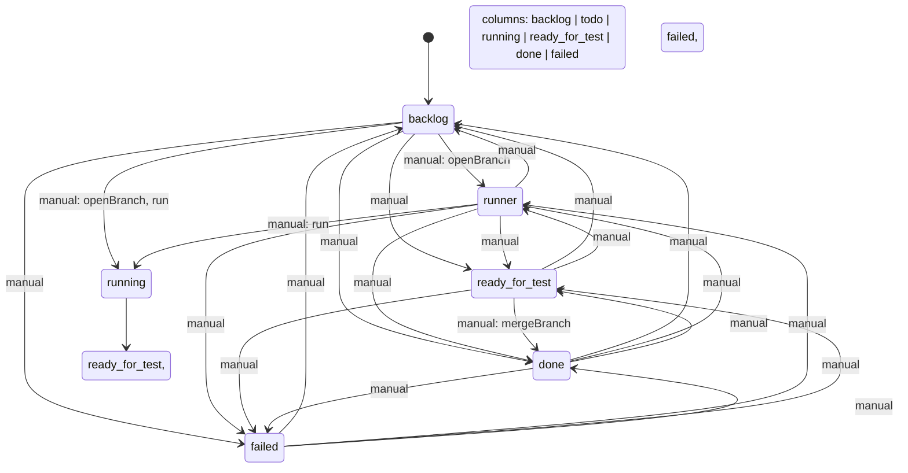

# State machine of the task board

The board's **columns are the task states**: the machine below is what the Host
enforces and what the browser renders. It is declared as plain data in
`src/core/state-machine.ts` (`DEFAULT_STATE_MACHINE`) and can be replaced per
deployment through the plugin config / settings namespace `task-board`, field
`stateMachine`.

A *transition* is an allowed state change together with the **actions** that
fire when it happens (open a feature branch, merge a feature branch, start a
run, stamp a field). Drag & drop is validated against exactly these
transitions — the browser asks the machine whether a drop is allowed, and the
Host refuses any `move` the machine does not list.



*Regenerate after changing the machine:*

```sh
node scripts/render-state-machine.mjs
```

`tests/state-machine.spec.ts` fails when this diagram no longer matches the
definition.

## Triggers

| Trigger  | Who fires it                                              |
|----------|-----------------------------------------------------------|
| `manual` | A human: drag & drop on the board, or a chip in the task detail. |
| `runner` | The execution runner settling a run (success → `ready_for_test`, failure → `failed`, cancel → `todo`). |
| `cron`   | A scheduled run.                                          |

`running` is the runner's own state: it carries `"drop": false` and only
`runner` transitions leave it. It is *entered* through the `run` action
(`todo → running`, and `backlog → running` for a drag straight onto
"In progress"), never by a plain status move.

## Actions attached to transitions

| Action              | Effect                                                                 |
|---------------------|------------------------------------------------------------------------|
| `git.openBranch`    | Cuts the card's feature branch (`task/<slug>-<id8>`) from the base branch. No-op without a git repository. |
| `git.mergeBranch`   | Commits what the run left behind and merges the branch back into its base branch, stamping `mergedAt`. |
| `run`               | Opens an execution for the card and moves it to the transition target (drag onto "In progress"). |
| `{ kind: "stamp", field: "doneAt" }` | Writes a timestamp into a task field.                    |

In the shipped machine the two git actions hang off exactly the two transitions
of the agentic-programming flow: `backlog → todo` opens the branch,
`ready_for_test → done` merges it back. Both fail the move when git refuses, so
a card never claims a branch or a merge that did not happen. The `run` action
sits on the way into `running`: `todo → running` starts the card, and
`backlog → running` (a drag straight onto "In progress") opens the feature
branch on the way.

## Configuration

```jsonc
{
  "initial": "backlog",
  "states": [
    { "status": "backlog" },
    { "status": "todo" },
    { "status": "running", "drop": false },
    { "status": "ready_for_test", "label": "Review" },
    { "status": "done" },
    { "status": "failed", "order": 9 }
  ],
  "transitions": [
    { "from": "backlog", "to": "todo", "actions": ["git.openBranch"] },
    { "from": "todo", "to": "running", "actions": ["run"] },
    { "from": "ready_for_test", "to": "done", "actions": ["git.mergeBranch"] }
  ]
}
```

* `states[].status` — one of `backlog`, `todo`, `running`, `ready_for_test`,
  `done`, `failed` (the ledger's closed vocabulary). `label` overrides the
  column title, `order` moves the column, `drop: false` makes it a column that
  never accepts a card.
* `transitions[]` — `from`/`to` plus optional `trigger`, `actions`, `git`
  (`false` skips the git hooks of that transition). Anything not listed is
  refused.
* `initial` — where new cards land; required when `backlog` is not a column.

Invalid configuration never bricks the board: the normalizer refuses the whole
document with reasons, the machine in force stays, and the settings card marks
the field invalid. The Host hands its resolved machine to the browser inside
the snapshot, so both halves always validate against the same transitions.
